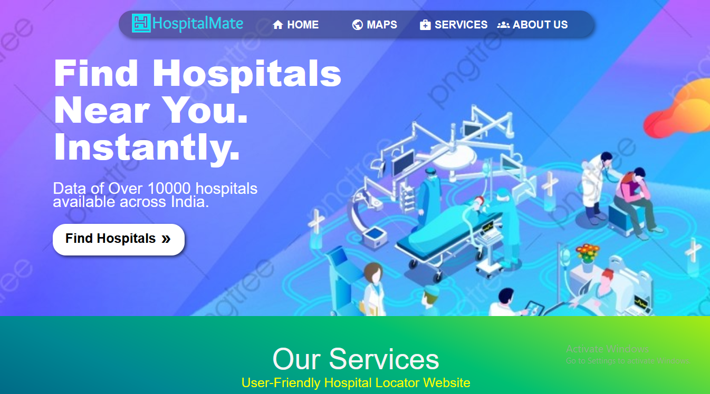
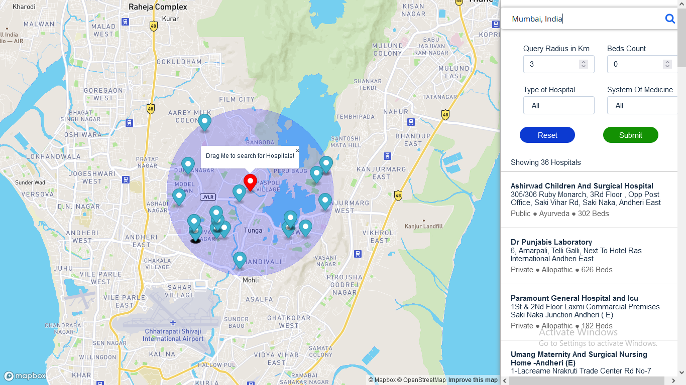

<p align="center">
<h1 align="center">Hospital-Locator</h1>
  <p align="center">
    Get the info about hospital near you.
    <br /> 
    </p>
</p>

### Try the Live-Demo Here
[Hospital Locator](http://hospital-locator.herokuapp.com/)
    
<!-- ABOUT THE PROJECT -->
## 📖About The Project
This is a course project part of Spatial Graph Database course 5th Semester.
### 🔧**Project Setup**  

This project has two part - frontend and deployed graph database on AuraDB.
To get a local copy up and running follow these simple example steps.

### Prerequisites
 You need to have pre-installed npm (a Node package manager)

### Installation

1. Clone the repo
   ```sh
   git clone https://github.com/CHAHATMB/Hospital-Locator.git
   ```
2. Install NPM packages
   ```sh
   npm install
   ```
3. Set environment variables:
    ```
    REACT_APP_NEO4J_URI=XXX
    REACT_APP_NEO4J_USER=XXX
    REACT_APP_NEO4J_PASSWORD=XXX
    REACT_APP_MAPBOX_TOKEN=XXX
    ```

    these can be added to `.env`
### Run

1. To run 
   ```sh
   npm start
   ```
2. To run in Development mode
   ```sh
   npm run dev
   ```

### 💻**Technology stack**
Tools and technologies that you learnt and used in the project:
1. ReactJS
2. Neo4j
3. Map Box
4. Git and Github


### 📸**Screenshots**
<h3>
Home page
</h3>


</br>
<a><h3>Map Page</h3>
</a>

### 👨‍💻**Team members**
* Chahat Baghele
* Mohak Chandani
* Vinakay Bodke

<!-- LICENSE -->
## License

Distributed under the MIT License. See `LICENSE` for more information.
